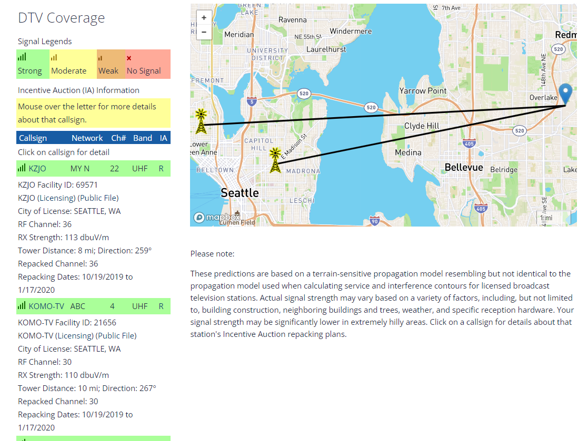

## Local Television Area

"A media market, broadcast market, media region, designated market area (DMA), television market area, or simply market is a region where the population can receive the same (or similar) television and radio station offerings." --- [https://en.wikipedia.org/wiki/Media_market](Wikipedia)

In the Internet era, with an ever increasing proportion of households that have 'cut-the-cord,' media markets mean less than ever. But local television news continues to draw older people. And local network affiliates are still an important part of media 'diets' of older Americans. 

Using [FCC DTV Maps](https://www.fcc.gov/media/engineering/dtvmaps), we first create a comprehensive database of all local channels per zip code. Then, we cluster zip codes using k-means, choosing k in a way that follows the 'elbow' rule. We also produce a clustering with the constraint that zip codes can only be merged with other zip codes in the 'same' county (over 90% share).

### Workflow

We use the list of [zip codes](data/us_zipcodes.csv) and iterate over [FCC DTV Maps](https://www.fcc.gov/media/engineering/dtvmaps) and produce a CSV with the following columns:

(each zipcode will have multiple rows --- one row per channel)

`zipcode, callsign, network, channel_number, band, ia, signal_strength (strong/moderate, weak, no signal), facility_id, city_of_license, rf_channel, rx_strength, tower_distance, repacked_channel, repacking_dates`

### Clustering

1. [group_zips](scripts/04_group_zips.py): clusters zip codes based on overlap between list of TV stations (with certain signal strength) and appends the grouping variable.
   
   The function takes 4 parameters:
   * data: String. Link to CSV in the format we are producing it in
   * diff: Integer. Maximum difference between the list of TV stations between zip codes
   * signal_strength: List. What TV stations we want to keep for comparison based on signal strength  
   * output: String. folder + filename. default = output.csv
  
   Output = Append an Integer field `group_number` to each row.

   `def group_zips(zip, diff = 0, signal = [strong, moderate,  ...]):`

   Functionality: 
   	1. Filters out list of tv stations per zip code based on signal_strength 
   	2. Filters out zip codes with no data
   	3. For each zip code, finds all zip codes where overlap between list of tv stations is as large as `diff`.

   We run it for diff = 0 and diff = 1 and save outputs separately as output_diff_1.csv, output_diff_2.csv

2. [k_means](scripts/k_means.py): a wrapper for k-means where we again pass on the same information with k = 200

   The function takes 4 parameters:
   * data: String. Link to CSV in the format we are producing it in
   * k: Integer. Number of clusters. 
   * signal_strength: List. What TV stations we want to keep for comparison based on signal strength  
   * output: String. folder + filename. default = output.csv
   
   Functionality:
   1. k-means in the feature space where each tv station gets a separate column (filered by signal strength)

   Output = Append an Integer field `cluster_number` to each row.

### Authors

Dev Kumar Pal and Gaurav Sood
